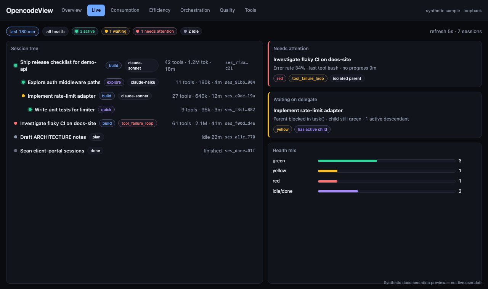
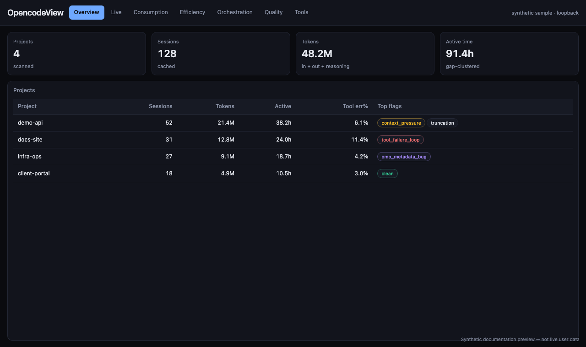
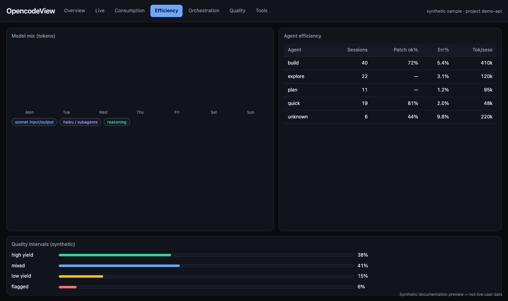
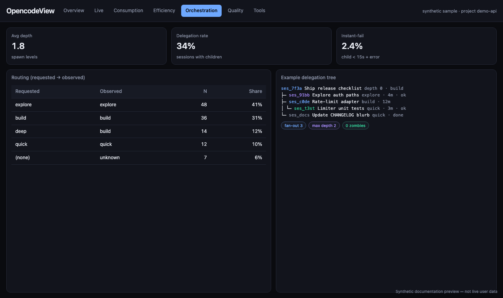

# OpencodeView

[](https://github.com/4i3n6/opencodeview/actions/workflows/ci.yml)
[](https://github.com/4i3n6/opencodeview/releases)
[](LICENSE)

**English** · [Português](README.pt-BR.md)

> Local-first analytics over OpenCode session data. Read-only on `opencode.db`. Separate derived cache. No SaaS, no telemetry.

OpencodeView is an **independent, unofficial companion** for people who already run [OpenCode](https://opencode.ai) locally. It is not part of OpenCode, not affiliated with the OpenCode team, and not a substitute for OpenCode's own product surface.

Site: <https://opencodeview.com>

**v0.9.0 is source-only.** Clone and run with Bun. No npm package, binary, container, or installer. Treat APIs, cache schema, CLI flags, and env vars as unstable until `1.0.0`.

### UI preview (synthetic sample data)

<table>
  <tr>
    <td width="50%"></td>
    <td width="50%"></td>
  </tr>
  <tr>
    <td width="50%"></td>
    <td width="50%"></td>
  </tr>
</table>

<p align="center"><sub>Synthetic documentation previews — not live user data. Projects, sessions, and metrics are fabricated.</sub></p>

Deeper map: [docs/ARCHITECTURE.md](docs/ARCHITECTURE.md) · [Português](docs/ARCHITECTURE.pt-BR.md)

---

## Relationship to OpenCode

OpenCode owns the agent runtime and the on-disk session store. OpencodeView only **reads** that store (and optional local logs), derives aggregates into its own cache file, and serves a local dashboard.

If something looks wrong in the source data, prefer investigating or reporting it in OpenCode when appropriate. Flags and quality hints here are **local operator signals** derived from rows on disk, not statements about OpenCode product quality.

## Who this is for

You already run OpenCode locally and want answers like:

- Which projects consume the most tokens and active time?
- Which models/agents show high tool-error rates or low patch yield?
- How deep or wide are subagent / delegation trees?
- What sessions are in progress right now, without exporting transcripts by hand?

If you need a hosted multi-tenant product, an official OpenCode UI, or a versioned public contract against `opencode.db`, see [Non-goals](#non-goals).

## Why it exists

OpenCode already persists rich local history. OpencodeView turns that history into project-scoped analytics on your machine, without sending session data to a third party.

| Principle | Behavior |
|---|---|
| Local-first | Default bind is loopback. No telemetry. No outbound calls from the app. |
| Read-only source | `opencode.db` opens with `readonly: true` + `PRAGMA query_only = 1`. |
| Separate cache | Derived metrics live in `OPENCODEVIEW_CACHE` only. Never alias the source file. |
| Redact before leave | Transcript/live payloads are redacted server-side before JSON leaves the process. |
| Fail closed | Non-loopback bind without `OPENCODEVIEW_AUTH_TOKEN` refuses to start. |

## Quick start

Requires [Bun](https://bun.sh) `>= 1.3.0` and a local OpenCode DB (default `~/.local/share/opencode/opencode.db`).

```bash
git clone https://github.com/4i3n6/opencodeview.git
cd opencodeview
bun install
cd web && bun install && cd ..

bun src/scan.ts --all   # materialize cache from opencode.db
bun run serve           # API  -> http://127.0.0.1:4317
bun run web             # UI   -> http://127.0.0.1:5273  (proxies /api)
```

Override the source DB:

```bash
OPENCODE_DB=/path/to/opencode.db bun src/scan.ts --all
```

## What you get

- **Overview** — project/global rollups: tokens, active time, tool calls, flags
- **Efficiency** — model/agent tables, quality intervals, matrix, frontier
- **Orchestration** — routing, depth, hygiene, delegation tree
- **Tools** — usage taxonomy, error classes, duration rollups when present
- **Live** — in-progress sessions from the source DB (redacted)
- **Transcript** — paginated session browser (redacted)
- **i18n** — EN-US / PT-BR UI; protocol IDs stay untranslated

## Architecture

Full one-pager: [docs/ARCHITECTURE.md](docs/ARCHITECTURE.md).

```
opencode.db (source, RO)          .cache/analytics.sqlite (cache)
        |                                    ^
        |  scan.ts (write cache only)        |
        +------------------------------------+
                         |
                    server.ts (RO on both)
                         |
              /api/*  -->  Vite UI (loopback)
```

Two SQLite connections, both read-only at the engine level:

1. **Source** (`OPENCODE_DB`) — never written by OpencodeView. Heavy queries are project-scoped and use `session_project_idx` / `part_session_idx` when available.
2. **Cache** (`OPENCODEVIEW_CACHE`, default `.cache/analytics.sqlite`) — written only by `bun src/scan.ts`; API opens it read-only.

Most `/api/*` routes read the cache only. Two routes hit the source at request time (still RO + redacted):

- `GET /api/session/:id/transcript`
- `GET /api/live`

### API surface (summary)

| Area | Routes |
|---|---|
| Meta / projects | `/api/meta`, `/api/global`, `/api/projects`, `/api/projects/:id`, `/api/projects/:id/sessions` |
| Session | `/api/session/:id`, `/api/session/:id/transcript` |
| Consumption | `/api/consumption`, `/timeline`, `/summary` |
| Efficiency | `/api/efficiency`, `/quality`, `/matrix`, `/frontier` |
| Orchestration | `/api/orchestration/summary`, `/routing`, `/hygiene`, `/top`, `/tree` |
| Time / quality | `/api/time`, `/api/data-quality` |
| Tools | `/api/tools`, `/api/tools/errors` |
| Live | `/api/live?since_min=180` |

### Session metrics (cache)

Tokens (in/out/reasoning/cache), tool call/error rates, `apply_patch_*`, compaction, part counts, latency, `active_min` / bursts (gap-clustered working time), `is_subagent`, and CSV `flags`.

### Flags

Heuristic labels on cached sessions. IDs are stable protocol strings (not translated).

| Flag | Rule (derived locally from cached/source fields) |
|---|---|
| `tool_failure_loop` | `tool_calls >= 20` and error rate > 30% |
| `patch_waste` | `patch_count > 50`, `apply_patch_ok = 0`, `summary_additions = 0` |
| `context_pressure` | `compaction_count > 15` |
| `truncation` | at least one message with `finish = length` |
| `omo_metadata_bug` | session title starts with the literal `undefined` |
| `security_anomaly` | title matches local string heuristics (e.g. injection-like phrases) |
| `low_yield_high_cost` | >1M tokens, no additions, no successful `apply_patch` |
| `data_quality_gap` | session month falls in a known low-coverage window for `summary_additions` (see limitations) |

## Security defaults

- Bind: `OPENCODEVIEW_HOST` default `127.0.0.1` (also `localhost` / `::1`). Host/Origin guards on loopback.
- Beyond loopback: `OPENCODEVIEW_AUTH_TOKEN` required or startup fails. `/api/*` expects `Authorization: Bearer <token>`.
- Redaction (`src/redaction.ts`): secret-like keys, bearer tokens, common provider prefixes (`sk-`, `ghp-`, …), URL userinfo, absolute home paths → `[REDACTED]`.
- API responses: `Cache-Control: no-store`.
- No telemetry / no outbound network from the app itself.

Exposing past loopback is an operator choice. Review redaction against your own data first.

## Environment

| Variable | Default | Purpose |
|---|---|---|
| `OPENCODE_DB` | `~/.local/share/opencode/opencode.db` | Source DB (RO) |
| `OPENCODEVIEW_CACHE` | `<repo>/.cache/analytics.sqlite` | Derived cache |
| `OPENCODEVIEW_HOST` | `127.0.0.1` | API bind; non-loopback needs auth token |
| `OPENCODEVIEW_AUTH_TOKEN` | unset | Bearer for non-loopback `/api/*` |
| `PORT` | `4317` | API port |
| `OH_MY_OPENCODE_LOG` | `$TMPDIR/oh-my-opencode.log` | Optional live activity tail |

## Commands

| Command | What it does |
|---|---|
| `bun src/scan.ts --list` | Cheap project list |
| `bun src/scan.ts <project>` | Scan one project into cache |
| `bun src/scan.ts --all` | Scan everything |
| `bun run serve` | API on `127.0.0.1:4317` |
| `bun run web` | UI on `127.0.0.1:5273` |
| `bun run check` | Full gate: test, typecheck, lint, build, audit, Gitleaks |
| `bun run release:check` | Release harness only |

Gitleaks is mandatory for `bun run check` (`gitleaks` on `PATH` or `GITLEAKS_BIN`).

## Development

```bash
bun run check          # before every PR
bun run test           # root + web
bun run typecheck
bun run lint
bun run build
```

Hooks (Lefthook): Conventional Commits, staged Gitleaks, release harness, and exclusive GitHub identity `4i3n6` on maintainer push.

UI strings live in `web/src/i18n` (`en-US` + `pt-BR`). Protocol IDs, model/tool names, session IDs, raw flags, and tab IDs stay untranslated. Visual rules: [DESIGN.md](DESIGN.md).

## Non-goals

- Replacing OpenCode or shipping an official OpenCode UI
- Claiming affiliation with or endorsement by the OpenCode team
- Cloud / multi-tenant hosted analytics
- npm/registry distribution or installer (source-run only)
- A stable, versioned integration contract against `opencode.db` before `1.0.0`

## Known limitations

- `opencode.db` is an internal OpenCode implementation detail. The adapter is best-effort and may lag upstream schema changes.
- `cost` is only comparable within the same billing regime; some auth modes report `0`.
- For sessions created in 2026-06 and 2026-07, `summary_additions` coverage in local data is incomplete; those sessions may be tagged `data_quality_gap`.
- Sessions that used legacy `edit`/`write` tools (not `apply_patch`) do not populate `apply_patch_*` counters.
- Expect breaking changes to cache schema, API, and CLI before `1.0.0`.

## Contributing

See [CONTRIBUTING.md](CONTRIBUTING.md). Short version:

1. Discuss security-sensitive changes (bind, auth, redaction, source RO) before coding.
2. Keep PRs atomic; Conventional Commits required.
3. `bun run check` must pass.
4. Update EN-US + PT-BR docs/i18n when user-visible behavior changes.

Security reports: private advisory only — [SECURITY.md](SECURITY.md).  
Data handling: [PRIVACY.md](PRIVACY.md).  
Maintainership: [GOVERNANCE.md](GOVERNANCE.md).  
Conduct: [CODE_OF_CONDUCT.md](CODE_OF_CONDUCT.md).

## License

[Apache License 2.0](LICENSE) — Copyright 2026 4i3n6.
